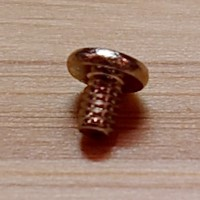
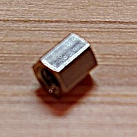
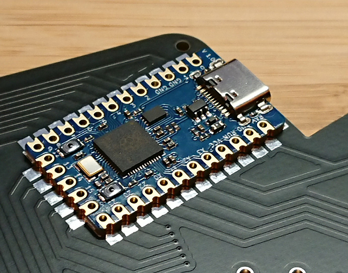
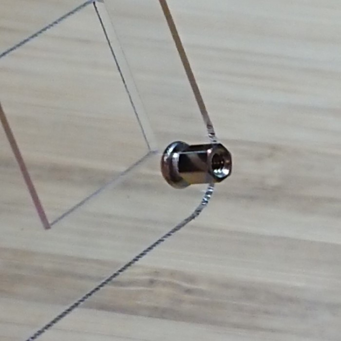
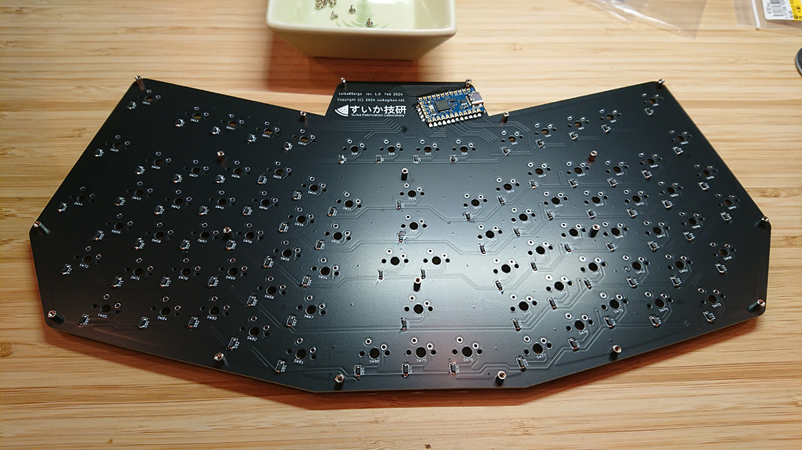
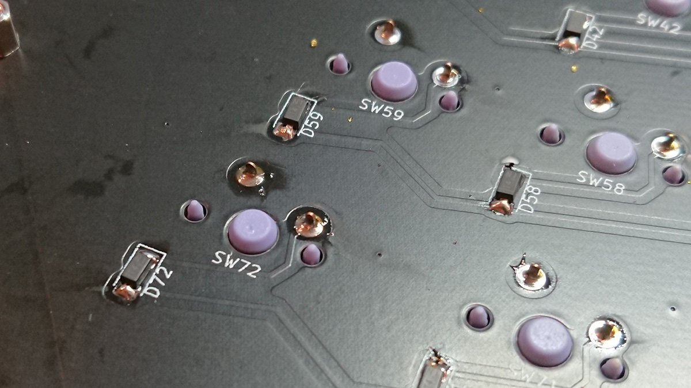

# suika85ergo ビルドガイド

## はじめに
このたびはsuika85ergoをお求めいただきありがとうございます。  
このドキュメントでは、このキーボードの組み立てから使用できるようになるまでの一連の流れを解説します。

## 用意するもの

### 同梱物
* プレート類（3種類）
  * メインボード 1枚
    * 部品を半田付けするメインとなる基板です
      
  * バックプレート 1枚
    * キーボードの一番底になる裏板です
      
  * キーマウントプレート 1枚
    * キーボードの一番上にくるプレートです
    * キースイッチをはめ込んで安定させるために使いますが、使用せずに組み立てることも可能です  
      
* ねじ類（3種類）
  * M2 x 3mm なべ小ねじ 40本（+ 予備1本）  
      
  * M2 x 3.5mm 両めねじ スペーサ 20本（+ 予備1本）  
      
  * M2 x 4mm めねじ/おねじ スペーサ 20本（+ 予備1本）  
      
* ゴム足
  * 高さ7mm 2個・高さ2mm 4個（お好みで背面に貼り付けてお使いください）  
          
* 表面実装ダイオード
  * 1N4148W 85個（+ 予備1個）  
      
* コントローラボード
  * Keebio製 Elite-C （ファームウエア書き込み済み）  
       
  
もし不足する部品等がありましたら Twitter [@suikagiken](https://twitter.com/suikagiken) のDMまでご連絡ください

### 別途用意が必要な部品
* キースイッチ 85個
  * Cherry MXスイッチ互換の5ピンまたは3ピンのものが使用可能です。
    * Kailh Chocロープロファイルスイッチのピン形状のスイッチは使えません。
    * ホットスワップ用キーソケットは使えません。
* キーキャップ 85個
  * お選びのキースイッチに対応したキーキャップをご用意ください。どのプロファイルでもOKです。
  * 想定しているサイズと個数は下記の通りですが、大きいキーキャップの代わりに小さいものを使用しても、隙間が少しできるだけで大きな問題はありません。
    * 1u x 76個
    * 1.25u x 2個
    * 1.5u x 7個
* USB Type-C ケーブル

### 必要な工具
このキットには表面実装部品があります。工具は電子工作用として一般的なものでも十分ですが、
お持ちでない場合や、お手元の工具が不安な場合、下記にあげたものがお勧めの一例です。いずれも秋月電子通商やアマゾンで購入できます。
* ハンダゴテ
  * 表面実装部品を取り付けるため、できるだけコテ先が細く、温度調節機能の付いたものをお勧めします
    * 白光 FX-600 （[秋月電子](https://akizukidenshi.com/catalog/g/g114456/)）
* 糸ハンダ
  * こちらもできるだけ細いものがお勧めです。また、鉛フリーハンダは扱いが難しいため慣れない方にはお勧めしません
    * ヤニ入りハンダ 0.65mm （[秋月電子](https://akizukidenshi.com/catalog/g/g109556/)）
* ハンダ吸い取り線
  * 取り付けミスがなければ不要ですが、用意があると安心です
    * ハンダ吸い取り線 3mm （[秋月電子](https://akizukidenshi.com/catalog/g/g102539/)）
* 精密ドライバー
  * M2のねじが止められるNo.0のプラスドライバーが必要です
    * 精密ドライバーセット （[秋月電子](https://akizukidenshi.com/catalog/g/g118343/)）
* ピンセット
  * 表面実装部品の取り付けに不可欠です。
    * 精密ピンセット （[秋月電子](https://akizukidenshi.com/catalog/g/g102541/)）

## 組み立て
このキーボード組み立ての一番の難関は最初の表面実装ダイオードのハンダ付けです。  
小さいダイオードを多数取り付けますので、落ち着いて慎重に進めて下さい。

### (1) 表面実装ダイオードのハンダ付け 
表面実装ダイオードは1N4148Wを使用しています。**下の写真の向き**に85個すべてのダイオードをハンダ付けします。  
**【ご注意】このキーボードでは一般的なダイオードの向きとは逆向きに取り付けるようになってしまっております。**  
**もし他のキーボードなどで同様のダイオードのハンダ付けを行う際には、それぞれのビルドガイドに沿って取り付けを行ってください。**  
**もしすでに異なる方向でハンダ付けをされた場合は、後述の「もしダイオードの向きを間違えた場合」をご参照ください。**

  
  

表面実装部品のハンダ付けが初めての方は次の項を参考にしてください。

#### ハンダ付けが初めての方向け
一連のハンダ付けの様子を動画にしましたのでぜひご覧下さい。  
[](https://youtu.be/nnGnuCSIDxg)  
左右は「右手（利き手）＝ハンダごて」「左手＝ピンセット・その他」として記載しています。利き手が左手の方は、お手数ですが左右を読み替えてください。
1. パーツをシートから取り出してお皿などに出す  
   * ピンセットで取りやすくするため、適当なお皿などを用意します。
   * 外にこぼさないように注意しながらシートを開け、お皿に取り出します。
2. メインボードのランドの片側だけに予備ハンダをする
   * 一度に両方のランドに予備ハンダを盛るのではなく、片側ずつ行うのがコツです。
   * 右手にハンダごて、左手に糸ハンダを持ちます。
   * ランドの右側に、0.5mm程度の高さに予備ハンダを盛ります。
3. ピンセットで位置を合わせながら片足をハンダ付けする
   * 右手にハンダごて、左手にピンセットを持ちます。糸ハンダはここでは持ちません。
   * **ダイオードの向きが正しいことを確認しながら**、予備ハンダをしたランドにダイオードの一方の足を合わせて置きます。
   * 足の上からハンダゴテで予備ハンダを溶かし、固定します。
4. もう片足をハンダ付けする
   * 右手にハンダごて、左手に糸ハンダを持ちます。
   * 上でハンダ付けしていないほうの足をハンダ付けします。
5. 2.～4.を85個分繰り返す
   * これらのダイオードのハンダ付けをひたすら根気よく繰り返します。**何よりダイオードの向きには特に注意**してください。
   * 「片足ばかりのハンダ付けを繰り返し、そのあともう片足ばかりのハンダ付けを繰り返す」でも構いませんが、その場合は片足のハンダのし忘れに注意してください。

#### もしダイオードの向きを間違えた場合
1. 全部のダイオードを反対の向きにつけた場合
   * ファームウエアの書き換え（info.jsonの7行目```"diode_direction": "COL2ROW"``` を ```"ROW2COL"```に書き換え）によって対応することが可能です。  
   * QMKファームウエアをコンパイルする環境をご用意いただき、このリポジトリにあるソースを元に上の修正を行った後、ファームウエアを作成の上書き込みを行ってください。
2. ダイオードの向きがバラバラの場合
   * 残念ながら付け直しが必要です。上の図の向きに揃うよう、反対向きのものを修正しましょう。 

### (2) コントローラボードのハンダ付け
コントローラボードにはKeebio製Elite-Cを使用しています。ハンダ付けにはピンを使わず、Elite-Cのボード端の金メッキ部とランドをブリッジする形で、Type-C端子が外を向くようにハンダ付けします。  
（**写真には青色のボードが写っていますが、実際は黒色のボードです**）  
  

初めての方は次の項を参考にしてください。慣れている方はそのまま(3)をご参照ください。

#### ハンダ付けが初めての方向け
1. ランドの1箇所に予備ハンダをする
   * 右手にハンダごて、左手に糸ハンダを持ちます。
   * コントローラボードのランドの1か所に予備ハンダをします。この1か所で位置決めをします。
2. コントローラボードの位置を合わせながら1か所ハンダ付けする
   * 右手にハンダごてを持ち、左手でコントローラボードを支え、ランドに合わせます。
   * 予備ハンダを溶かしながら、コントローラボードが正しい位置に来るようにしてハンダ付けします。
3. 残りのランドをハンダ付けする
   * 右手にハンダごて、左手に糸ハンダを持ち、残りの端子をしっかりハンダ付けします。
4. 最初の端子のハンダを補強する
   * 予備ハンダのみでつけていてハンダが不足する場合は、再度しっかりハンダを盛ります。

### (3) 動作確認
この時点でダイオードとコントローラボードの取り付けができていると思いますが、このコントローラボードはファームウエア書き込み済みのため、スイッチを取り付ける前のこの段階で動作確認が可能です。
1. Type-CケーブルでPCに接続します。しばらくして新しいデバイスとしてPCに認識されることを確認します。
2. ブラウザでQMK Configuratorのキーボードテスト https://config.qmk.fm/#/test を起動します
3. それぞれのキーに相当する端子をピンセットなどでショートして、キー入力として認識するかどうかを確認します
   もしこの時点で反応しない端子がある場合、パーツの取り付けに何らかのミスがあることが考えられます。ダイオードの取り付け向きや、コントロールボードのハンダ不良がないかを確認してください。

### (3) マウントプレートへのねじ・スペーサの取り付け
キーのマウントプレートを使用する際は、まずねじとスペーサを先に取り付けておくとあとの工程が容易です。  
最初にプレートの裏表を確認します。机などに置いたときに、「最左列に穴が4つ・最右列に穴が3つ」になるように置くと、「上が表・下が裏」になります。この表にねじ・裏にスペーサになるようにぞれぞれを取り付けます。  
  
1. 表側からM2 x 3mm なべ小ねじをあてがう
2. 裏側からM2 x 3.5mm 両めねじ スペーサを手でねじ込む
3. スペーサを押さえながら、ドライバーで増し締めする  
   下の写真のように全部のねじが取り付けられればOKです。  
  
なお、マウントプレートなしで直接メインボードにスイッチをはめてハンダ付けすることも可能です。その場合は位置決めを慎重に行ってください。5ピンのスイッチを使用する場合は比較的容易ですが、3ピンのスイッチの場合、ピンの遊びでキーが揃いにくくなりますのでハンダ付け時に注意が必要です。

### (4) マウントプレートのメインボードへの取り付け
マウントプレートとメインボードを組み付けます。
1. マウントプレートのスペーサ側を上にして置き、その上にハンダ面を上にしたメインボードを重ねる
2. 20か所のねじ穴に、M2 x 4mm めねじ/おねじ スペーサをねじ込む。  
     
3. すべてをしっかりねじ止めできたら完成です。  
     

### (5) キースイッチの取り付け・ハンダ付け

1. マウントプレートの穴にキースイッチをしっかり奥まで差し込む  
   このとき、少しでもプレートから浮いているとゆがみにつながります。しっかりとプレートにはまったことを確認してください。
    
2. すべて差し込み終わったら落ちないようにゆっくり裏返してハンダ面を表にする
3. 85個のキースイッチの2ピンずつをハンダ付けする  
   ハンダ付けの際にももう一度スイッチが浮いていないか確認してください。  
   
    

### (8) バックプレートのねじ止め・ゴム足の取り付け
1. メインボードのハンダ面を表にして置き、その上に「すいか技研」の文字のプリントを表にしたバックプレートを重ねる
2. 20か所のねじ穴に、M2 x 3mm なべ小ねじをねじ込む。
3. バックプレートの好きな場所にお好みでゴム足を取り付ける。  
   

### (9) キーキャップの取り付け
最後に、キースイッチにお好みのキーキャップを取り付けて、組み立ては完了です。  
   
  

## ファームウエアの書き込み
**【通常はこの手順をスキップできます】**  
同梱のコントローラボードにはすでにファームウエアを書き込んであるため、改めてファームウエアを書き込む必要はありません。  
もし何らかの理由で誤ってファームウエアを消してしまった場合や、別のコントローラボードを使う場合は次の手順を参考にしてください。  
なお、組み立て済みでバックボードまで取り付けている場合は、Elite-Cの書き込みボタンにアクセスできるよう、いったんバックボードは外してください。
### QMK ToolBoxのインストール
1. https://github.com/qmk/qmk_toolbox/releases からQMK Toolboxをダウンロードし、インストールします。

### suikagiken_suika85ergo_default.hex の書き込み
1. [すいか技研のリポジトリ](https://github.com/suikagiken/suika85ergo) のhexフォルダから、ファームウエアのファイル[suikagiken_suika85ergo_via.hex をダウンロード](https://github.com/suikagiken/suika85ergo/blob/main/hex/suikagiken_suika85ergo_via.hex)し、適当な場所に保存する
2. QMK Toolboxを起動し、Openをクリックして下図の①のようにファームウエアファイルを指定する
3. Elite-Cボードのボタンを押し、ファーム書き込みモードにする  
   ②のメッセージが出たら準備完了です。
4. ③のFlashボタンをクリックして書き込みが終わるのを待つ  
   ④のメッセージが出たら書き込みが完了ですので、ケーブルを抜きます。  
   

## VIAの起動・キーマップの編集
いよいよ最後の工程です。VIAを使ってキーマップを編集します。  
**VIAは Chrome または Edge のブラウザでのみ使用できます**。残念ながらFirefoxには対応していませんのでご注意ください。
1. Chrome または Edge ブラウザで https://usevia.app/ にアクセスする
2. Authorize deviceをクリックすると、「usevia.appがHIDデバイスへの接続を要求しています」という画面が開くので「suika85ergo」を一覧から選択し「接続」をクリックする
3. 上部メニューの歯車アイコン（Settings）をクリックし、「Show Design Tab」をオンにする
4. 上部メニューにハケのアイコン（Design）がでるのでそれをクリックし、「Confirm」をクリックする
5. [すいか技研のリポジトリ](https://github.com/suikagiken/suika85ergo) の via_definition フォルダから、定義ファイル [suika85ergo.json をダウンロード](https://github.com/suikagiken/suika85ergo/blob/main/via_definition/suika85ergo.json)し、適当な場所に保存する
6. Load Draft Definitionの項目にあるLoadボタンをクリックし、suika85ergo.json を指定する
7. 上部メニューのキーボードアイコン（Configure）をクリックする  
   下図のようにキーボードのデザインが正しく表示されていれば、キーマップの編集準備完了です。  
      

あとはご自身で自由にカスタマイズして便利なキーボードに育ててください！


## おわりに
長々としたビルドガイドに最後までお付き合いくださりありがとうございました。  
組み立ての途中や組み立て後のご使用中にトラブルやご不明点がございましたら、お気軽に Twitter [@suikagiken](https://twitter.com/suikagiken) のDMまでご連絡ください。  
引き続きすいか技研をご愛顧くださいますようお願いいたします。

