# suika85ergo ビルドガイド

## はじめに
このたびはsuika85ergoをお求めいただきありがとうございます。  
このドキュメントでは、このキーボードの組み立てから使用できるようになるまでの一連の流れを解説します。  
**このドキュメントは rev.1.1 に対応したものになります。**  
**rev1.0 をお持ちの方は [こちら](buildguide.md) をご参照ください。**

## 用意するもの

### 同梱物
* プレート類（3種類）
  * メインボード 1枚
    * 部品を半田付けするメインとなる基板です。コントローラボード（Keebio製 Elite-Pi）も取り付け済みです。  
      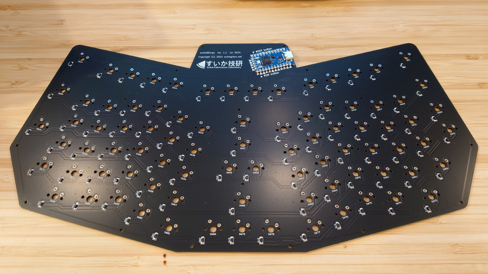
  * バックプレート 1枚
    * キーボードの一番底になる裏板です
      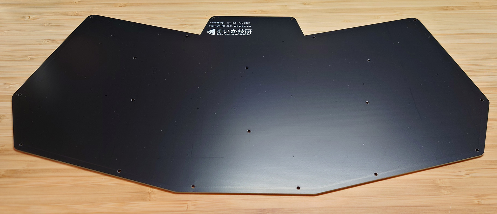
  * キーマウントプレート 1枚
    * キーボードの一番上にくるプレートです
    * キースイッチをはめ込んで安定させるために使います（使用せずに組み立てることも可能です）  
      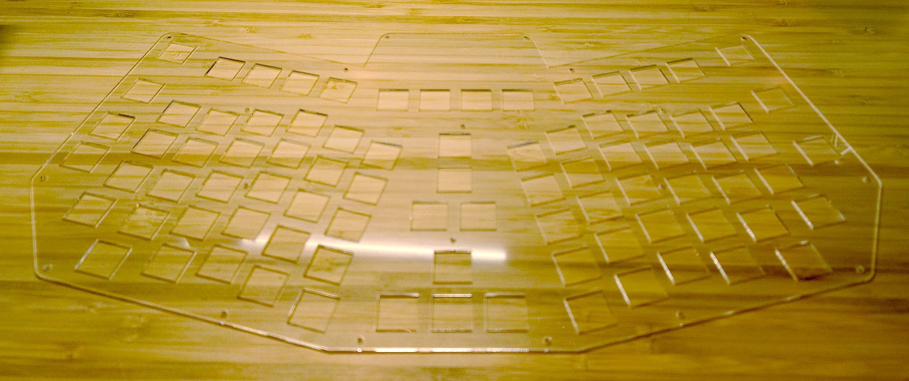
* ねじ類（3種類）
  * M2 x 3mm なべ小ねじ 40本（+ 予備1本）  
     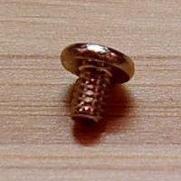  
  * M2 x 3.5mm 両めねじ スペーサ 20本（+ 予備1本）  
     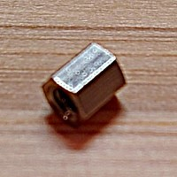  
  * M2 x 4mm めねじ/おねじ スペーサ 20本（+ 予備1本）  
     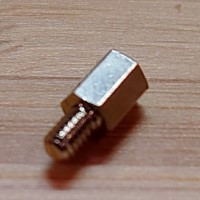  
* ゴム足
  * 高さ 約10mm 2個・高さ 約2mm 4個（お好みで背面に貼り付けてお使いください）  
     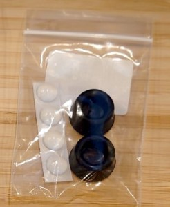
  
もし不足する部品等がありましたら Twitter [@suikagiken](https://twitter.com/suikagiken) のDMまでご連絡ください

### 別途用意が必要な部品
* キースイッチ 85個
  * Cherry MXスイッチ互換の5ピンまたは3ピンのものが使用可能です。
    * Kailh Chocロープロファイルスイッチのピン形状のスイッチは使えません。
    * ホットスワップ用キーソケットは使えません。
* キーキャップ 85個
  * お選びのキースイッチに対応したキーキャップをご用意ください。どのプロファイルでもOKです。
  * 想定しているサイズと個数は下記の通りですが、大きいキーキャップの代わりに小さいものを使用しても、隙間が少しできるだけで大きな問題はありません。
    * 1u x 76個
    * 1.25u x 2個
    * 1.5u x 7個
* USB Type-C ケーブル

### 必要な工具
工具は電子工作用として一般的なものでも十分ですが、お持ちでない場合や、お手元の工具が不安な場合、下記にあげたものがお勧めの一例です。いずれも秋月電子通商やアマゾンで購入できます。
* ハンダゴテ
  * 温度調節機能の付いたものをお勧めします
    * 白光 FX-600 （[秋月電子](https://akizukidenshi.com/catalog/g/g114456/)）
* 糸ハンダ
  * 0.65~0.8mm程度の細さのものがお勧めです。また、鉛フリーハンダは扱いが難しいため慣れない方にはお勧めしません
    * ヤニ入りハンダ 0.65mm （[秋月電子](https://akizukidenshi.com/catalog/g/g109556/)）
* ハンダ吸い取り線
  * 取り付けミスがなければ不要ですが、用意があると安心です
    * ハンダ吸い取り線 3mm （[秋月電子](https://akizukidenshi.com/catalog/g/g102539/)）
* 精密ドライバー
  * M2のねじが止められるNo.0のプラスドライバーが必要です
    * 精密ドライバーセット （[秋月電子](https://akizukidenshi.com/catalog/g/g118343/)）

## 組み立て

### (1) マウントプレートへのねじ・スペーサの取り付け
マウントプレートには、まずねじとスペーサを先に取り付けておくとあとの工程が容易です。  
最初にプレートの裏表を確認します。机などに置いたときに、「最左列に穴が4つ・最右列に穴が3つ」になるように置くと、「上が表・下が裏」になります。この表にねじ・裏にスペーサになるようにぞれぞれを取り付けます。  
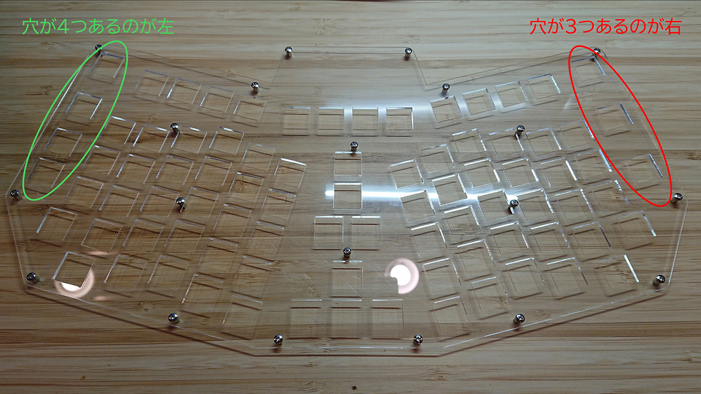  
1. 表側からM2 x 3mm なべ小ねじをあてがう
2. 裏側からM2 x 3.5mm 両めねじ スペーサを手でねじ込む
3. スペーサを押さえながら、ドライバーで増し締めする  
   下の写真のように全部のねじが取り付けられればOKです。  
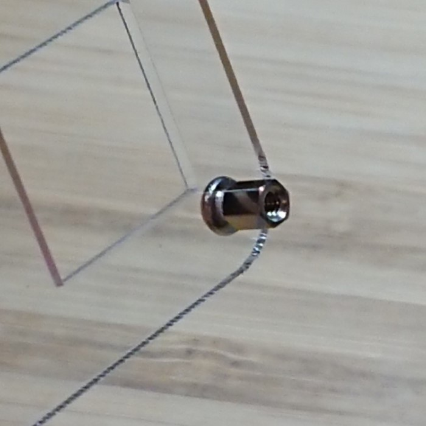  
なお、マウントプレートなしで直接メインボードにスイッチをはめてハンダ付けすることも可能です。その場合は位置決めを慎重に行ってください。5ピンのスイッチを使用する場合は比較的容易ですが、3ピンのスイッチの場合、ピンの遊びでキーが揃いにくくなりますのでハンダ付け時に注意が必要です。

### (2) マウントプレートのメインボードへの取り付け
マウントプレートとメインボードを組み付けます。
1. マウントプレートのスペーサ側を上にして置き、その上にハンダ面（コントローラボードがある面）を上にしてメインボードを重ねる
2. 20か所のねじ穴に、M2 x 4mm めねじ/おねじ スペーサをねじ込む。  
   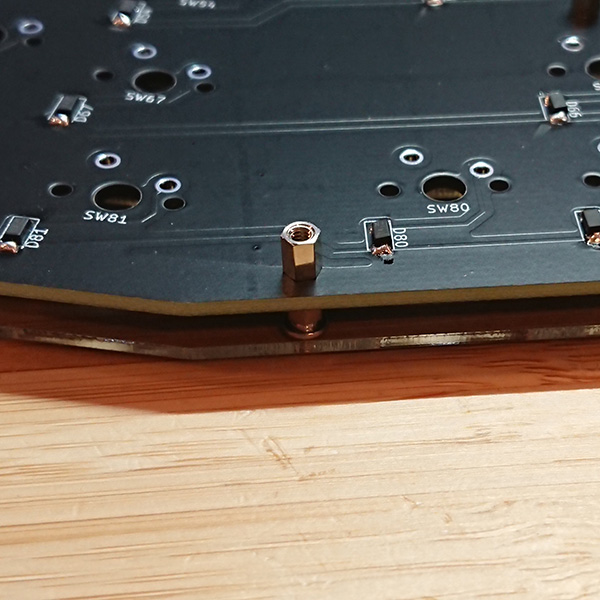  
3. すべてをしっかりねじ止めできたら完成です。  
   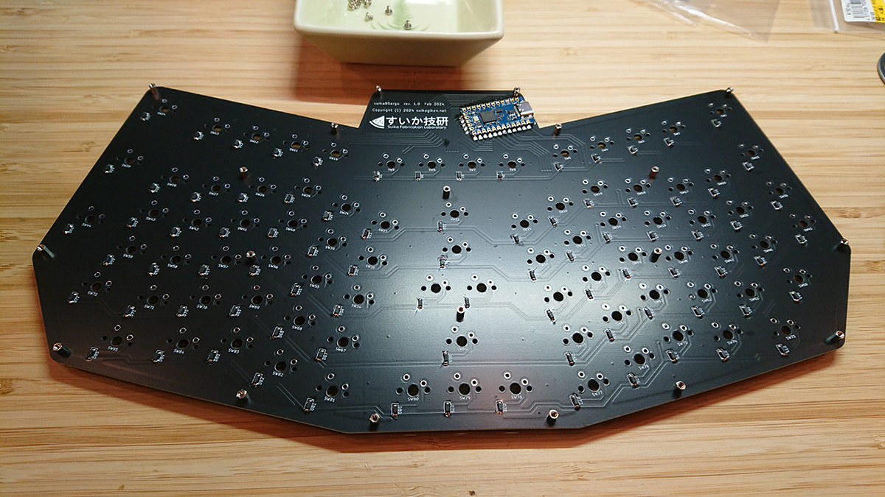  

### (3) キースイッチの取り付け・ハンダ付け
1. マウントプレートの穴にキースイッチをしっかり奥まで差し込む  
   このとき、少しでもプレートから浮いているとゆがみにつながります。しっかりとプレートにはまったことを確認してください。
    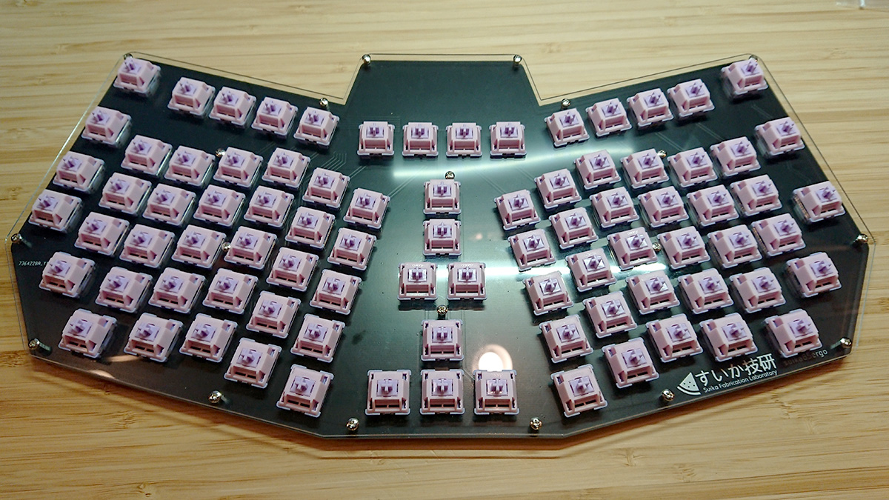
2. すべて差し込み終わったら落ちないようにゆっくり裏返してハンダ面を表にする
3. 85個のキースイッチの2ピンずつをハンダ付けする  
   ハンダ付けの際にももう一度スイッチが浮いていないか確認してください。  
   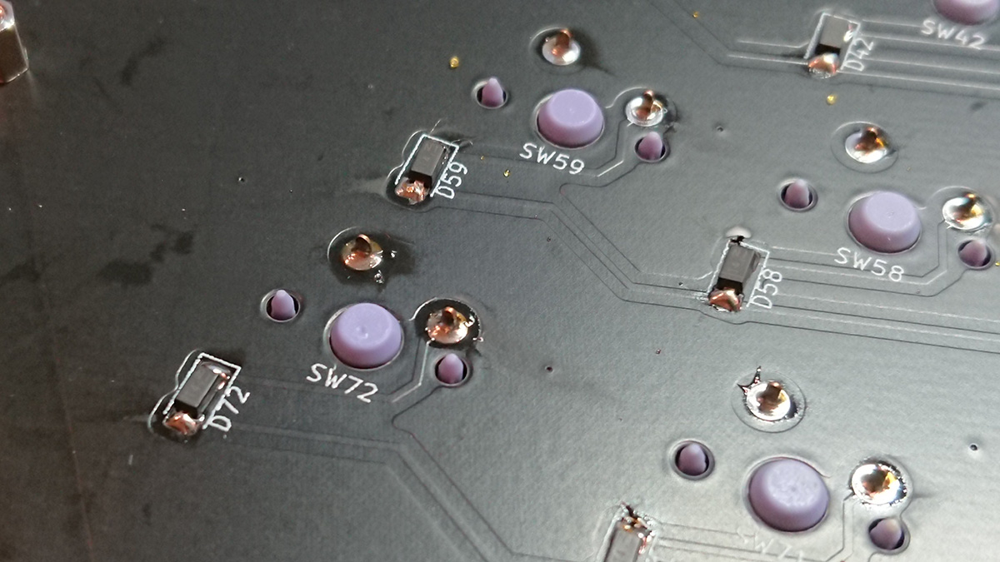

### (4) バックプレートのねじ止め・ゴム足の取り付け
1. メインボードのハンダ面を表にして置き、その上に「すいか技研」の文字のプリントが上部にある方を表にしたバックプレートを重ねる
2. 20か所のねじ穴に、M2 x 3mm なべ小ねじをねじ込む。
3. バックプレートの好きな場所にお好みでゴム足を取り付ける。  
   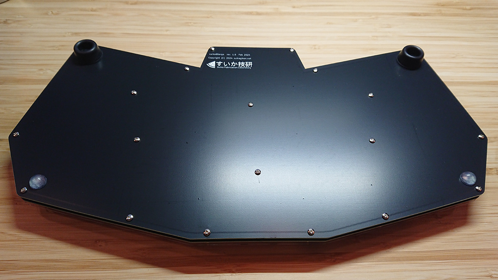

### (5) キーキャップの取り付け
最後に、キースイッチにお好みのキーキャップを取り付けて、組み立ては完了です。  
   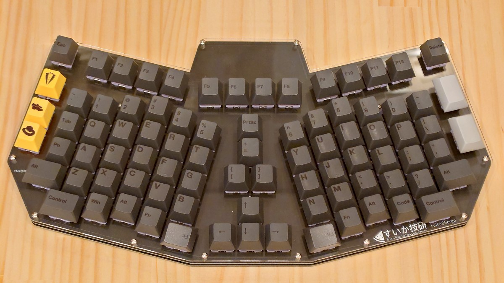
  
## VIAの起動・キーマップの編集
いよいよ最後の工程です。VIAを使ってキーマップを編集します。  
**VIAは Chrome または Edge のブラウザでのみ使用できます**。残念ながらFirefoxには対応していませんのでご注意ください。
1. Chrome または Edge ブラウザで https://usevia.app/ にアクセスする
2. Authorize deviceをクリックすると、「usevia.appがHIDデバイスへの接続を要求しています」という画面が開くので「suika85ergo」を一覧から選択し「接続」をクリックする
   
   下図のようにキーボードのデザインが正しく表示されていれば、キーマップの編集準備完了です。  
      

あとはご自身で自由にカスタマイズして便利なキーボードに育ててください！

### ファームウエアの書き換え方
**【通常はこの手順は不要です】**  
同梱のコントローラボードにはすでにファームウエアを書き込んであるため、改めてファームウエアを書き込む必要はありません。  
ファームウエアにカスタマイズを加えて使う場合や、もし何らかの理由で誤って消してしまったファームウエアを再度書き込む場合は、次の手順を参考にしてください。  
なお、組み立て済みでバックボードまで取り付けている場合は、Elite-Piの書き込みボタンにアクセスできるよう、いったんバックボードは外してください。

#### suikagiken_suika85ergo_via.uf2 の書き込み
1. [すいか技研のリポジトリ](https://github.com/suikagiken/suika85ergo) のuf2フォルダから、ファームウエアのファイル[suikagiken_suika85ergo_via.uf2 をダウンロード](https://github.com/suikagiken/suika85ergo/blob/main/uf2/suikagiken_suika85ergo_via.uf2)し、適当な場所に保存する
2. 次のいずれかの操作を行って、ブートローダーモードにする  
   1. BOOTボタンを押しながらRUNボタンを押す
   2. BOOTボタンを押しながらケーブルを挿入する
3. USBマスストレージとして認識され、エクスプローラ画面が開いたら、ダウンロードした.uf2ファイルをコピーします。程なく自動的にリセットがかかります。
4. 再度USBデバイスとして認識された状態になれば完了です。  

## おわりに
長々としたビルドガイドに最後までお付き合いくださりありがとうございました。  
組み立ての途中や組み立て後のご使用中にトラブルやご不明点がございましたら、お気軽に Twitter [@suikagiken](https://twitter.com/suikagiken) のDMまでご連絡ください。  
引き続きすいか技研をご愛顧くださいますようお願いいたします。

